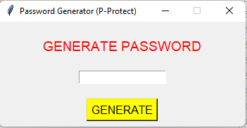

# Dillinger
## _The Last Markdown Editor, Ever_

[](https://nodesource.com/products/nsolid)

[](https://travis-ci.org/joemccann/dillinger)

# Generator haseł
> Prosta, okienkowa aplikacja do generowania haseł. 

## Menu
* [Informacje ogólne](#informacje-oglne)
* [Zrzut ekranu](#zrzut-ekranu)
* [Technologie](#technologie)
* [Instalacja](#instalacja)
* [Kod](#kod)
* [Plan rozwoju](#plan-rozwoju)
* [Status](#status)
* [Inspiracje](#inspiracje)
* [Kontakt](#kontakt)

## Informacje ogólne
Szybki generator haseł.

## Zrzut ekranu


## Technologie
* Python

## Instalacja
* EXE na Windows
* PY plik odpalany na dowolnym systemie operacyjnym z użyciem interpretera 

## Przykładowy kod


```          length = random.randint(9, 10)
        for i in range(length+1):
            special = random.choice(spc)
            number = random.choice(not_spc1)
            non_special = random.choice(not_spc2)
            non_special2 = random.choice(not_spc3)
            choice_lst.append(special)
            choice_lst.append(number)
            choice_lst.append(non_special)
            choice_lst.append(non_special2)
            choice = random.choice(choice_lst)
```


## Plan rozwoju

* exe

## Status
Status projektu: _in progress_, 

## Inspiracje
Projekt autorski.

## Kontakt
Wykonany przez [@ithelparturgolata](ithelparturgolata@gmail.com) 